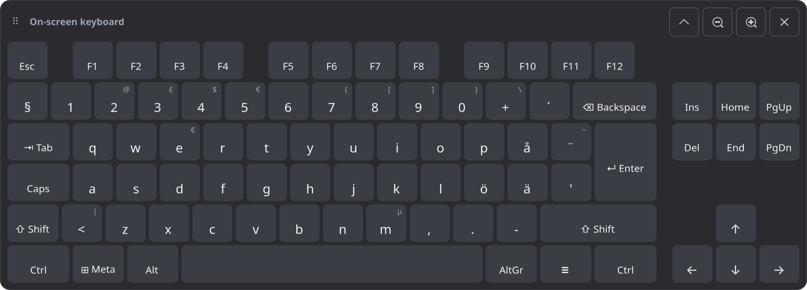

# fi-osk — Finnish on-screen keyboard for KDE Plasma (Wayland)

A full Windows-style keyboard (function keys, arrows, Home/End, Ctrl/Alt/AltGr/Meta, Finnish
å ä ö and dead keys) that floats above all windows without stealing focus.

## Requirements

- KDE Plasma 6 on Wayland (tested on Fedora 44, Plasma 6.7)
- Python 3 with PyGObject and GTK 4 (preinstalled on Fedora KDE)
- `gtk4-layer-shell` (the installer offers to install it with `dnf`)

## Install

    git clone https://github.com/SanttuA/on-screen-keyboard.git
    cd on-screen-keyboard
    ./install.sh

This installs into your home folder only: `~/.local/bin/fi-osk` and a menu entry.

Then open **On-Screen Keyboard (Finnish)** from the app menu. Right-click it there and choose
**Pin to Task Manager**. After that, clicking the panel icon shows or hides the keyboard.

The first time it opens, Plasma asks whether to allow remote input. Allow it.
The permission is remembered, so you only see this once.

## Using it

| Action | How |
|---|---|
| Show / hide | Click the panel icon (or run `fi-osk`), or click ✕ on the keyboard |
| Shift / Ctrl / Alt / AltGr / Meta | Click once: applies to the next key only. Double-click: stays on. Click again: off |
| Hold a key (Backspace, arrows…) | Hold the mouse button: the key repeats |
| Move it | Drag the top bar (the "⠿ On-screen keyboard" strip) |
| Dock to the top or bottom edge | ↑/↓ button |
| Make it smaller or bigger | −/+ buttons |
| Quit completely | `fi-osk --quit`, or right-click the menu entry → Quit keyboard |

## Security

- Typing goes through the standard XDG RemoteDesktop portal, which Plasma has to approve.
  It needs no root access, no `/dev/uinput` access and no background service.
- The keyboard window can never get keyboard focus, so it can't read what you type on your real keyboard.
- Nothing is logged and nothing uses the network. The only file written is the portal
  permission token: `~/.local/state/fi-osk/restore-token` (mode 0600).
  Run `fi-osk --no-remember` to skip saving it. To revoke the permission, delete that file.

## License

MIT, see [LICENSE](LICENSE).
